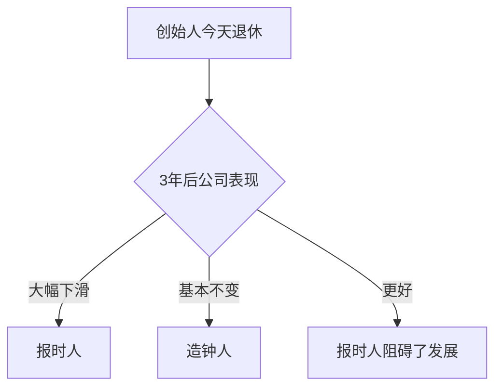

# 段永平论企业文化与创始人深潜

> 以下内容均整理自段永平原话，来源为《段永平投资问答录（商业逻辑篇）》及网易博客。
>
> ⚠️ **本文件有两个用途：**
> 1. **企业文化诊断**（Path A的Step 3b / Path B的Step 3c）——评估组织文化是否健康
> 2. **创始人深潜**（Path B的Step 3a）——对创始人驱动的公司，先深入理解创始人
>
> 根据`01-认知金字塔-总纲.md`的双路径模型，**B型公司（创始人优先型）**请先跳转到"第二部分：创始人深潜"。

---

# 第一部分：企业文化诊断

> 用于所有公司的企业文化评估环节。

---

## 一、总论：企业文化决定生意能走多远

> **"好的生意模式往往有好的企业文化做支撑。"**

> **"如果不是 right people，多数情况下没办法维持 right business。"**

### 商业模式 vs 企业文化的关系

```
商业模式 = 天花板（决定能飞多高）
企业文化 = 地板（决定不会摔多惨）

关系链：
  好的商业模式 → 吸引优秀人才 → 强化好的企业文化 → 维持商业模式
  坏的商业模式 → 即使有好文化也很难维持（如航空公司）

但反过来也成立：
  坏的文化 → 再好的商业模式也会被毁掉
```

### 企业文化在决策框架中的位置

```
Path A（生意优先型）：商业模式通过 → 企业文化 → 价格
Path B（创始人优先型）：创始人深潜通过 → 商业模式通过 → 企业文化 → 价格

在企业文化环节，核心问题：这个组织健康吗？文化能持续吗？
```

---

## 二、本分——最核心的文化特质

> **"我们理解的本分就是：'做对的事情、把事情做对'。"**

### 本分的三个层次

**第一层：求责于己**

> **"本分是当出现问题时，首先求责于己的态度。"**

```
☑ 遇到挫折时，对外找原因还是对内找原因？
☑ 业绩不好时，是怪市场/竞争对手/用户，还是反思自己的问题？
☑ 出现问题，第一反应是"谁错了"还是"我们能做什么"？
```

**第二层：我不赚人便宜**

> **"本分规范了与人合作的态度——我不赚人便宜。"**

```
☑ 对供应商是否按时付款？
☑ 对消费者是否真诚，还是用营销话术掩盖缺陷？
☑ 对员工是否公平？（"我就不喜欢996或997"）
☑ 企业文化里是否有"占便宜"的倾向？
```

**第三层：平常心**

> **"保持平常心，坚持做正确的事，并力求把事情做正确。"**

```
☑ 公司是否为了短期业绩做损害长期利益的事？
☑ 是否追逐热点（追风口、炒概念）？
☑ 是否在压力下改变原则？
☑ 管理层讲话是务实还是夸夸其谈？
```

### 不本分的红旗信号

- 财务造假
- 大股东频繁套现
- 关联交易掏空上市公司
- 高管言论与行为不一致
- 对供应商/客户/员工不公平
- 追逐热点、概念炒作

---

## 三、消费者导向

> **"从消费者的角度来设计产品、提供服务，避免做貌似消费者喜欢的东西。"**

### 如何判断消费者导向

| 问 | 正面信号 | 负面信号 |
|----|---------|---------|
| 产品决策的依据是什么？ | 用户调研、用户反馈 | 竞争对手在做什么、成本考量优先 |
| 产品有问题时怎么办？ | 主动召回、坦诚沟通 | 隐瞒、推诿、公关掩盖 |
| 资源投在哪里？ | 研发、用户体验、售后 | 营销、渠道费用远超研发 |
| 长期 vs 短期冲突时选什么？ | 用户长期价值 | 季度业绩 |

> **"苹果的产品确实把用户体验或消费者导向做到极致了。"**

> **"说追求'性价比'的公司大多是在为自己的低价找借口。"**

---

## 四、造钟人 vs 报时人

> **"《基业长青》是本好书啊，不过这本书让我失去了早期投资苹果的机会。"**

### 核心概念

| 类型 | 含义 | 特征 |
|------|------|------|
| **报时人** | 告诉你现在几点了 | 依赖个人能力，离开了就不行 |
| **造钟人** | 造了一个钟，走不停 | 建立了制度和文化，离开了也能持续 |

### 造钟人测试

> **"库克其实就是乔布斯最伟大的发明（发现）之一。"**



### 在框架中的位置

```
对于Path A（生意优先型）：
  造钟人测试 → 验证生意模式能持续多久
  例：苹果已经明确是造钟人（库克接班成功）
  
对于Path B（创始人优先型）：
  造钟人测试 → 判断创始人风险有多大
  例：泡泡玛特正在从报时人向造钟人转型（王宁在做组织建设）
```

---

## 五、Stop Doing List（不为清单）

> **"好的公司都一定是有一个长长的'Stop doing list'，就是'不做的事情'。"**

### 段永平的投资Stop Doing List

| 不做的事 | 原因 |
|---------|------|
| 不做空 | "做空有无限风险，一次错误就可能致命" |
| 不借钱/不用margin | "无论多有把握也绝对不要用margin" |
| 不懂不做 | "不懂不做，只要你这么做，就叫价值投资" |
| 不买新股 | "五六十倍pe的新股可真是需要勇气啊" |
| 不投数量太多 | "投的企业越多赚的越少" |

### 诊断问题——分析目标公司的 Stop Doing List

```
□ 这家公司有没有明确的"不做的事"？
□ 它的经营行为是"什么都做"还是"有选择地做"？
□ 它有没有做过什么让人不安的事？
□ 会不会为了增长去做任何事？（无底线增长是红旗信号）
□ 面对诱惑时，管理层怎么选择？
```

---

## 六、企业文化红旗信号（一票否决）

| 红旗信号 | 严重程度 |
|---------|---------|
| 财务造假 | ⭐⭐⭐⭐⭐ |
| 大股东持续套现 | ⭐⭐⭐⭐⭐ |
| 关联交易异常 | ⭐⭐⭐⭐ |
| 管理层言行不一 | ⭐⭐⭐⭐ |
| 追逐热点/概念炒作 | ⭐⭐⭐ |
| 无底线增长 | ⭐⭐⭐ |

---

## 七、企业文化确定性等级

| 等级 | 含义 | 行动 |
|------|------|------|
| **高** | 明确的本分文化，经5年以上验证，造钟人已就位，有清晰Stop Doing List | 通过，进入下一关 |
| **中** | 文化不错但验证不够，或CEO评估正面但有不确定因素 | 通过但保持关注 |
| **低** | 有红旗信号，或信息严重不足 | **一票否决** |

---

# 第二部分：创始人深潜（Path B 专用方法论）

> **以下内容专门用于创始人优先型（B型）公司的第一步深度分析。**
>
> 段永平投资泡泡玛特的过程揭示了：对于某些公司，**理解创始人本身就是理解生意的钥匙。**
>
> 这部分不是"企业文化"，而是**独立于企业文化之外的创始人评估方法论。**

---

## 八、为什么创始人评估可以独立于企业文化？

段永平说：

> **"我理解王宁不是因为我的投资，而是因为我曾经是个企业家，我能看懂他有多厉害。"**

> **"王宁对商业的理解好像比Jobs还要强一点点。"**

这些判断不是"企业文化打分"能捕捉的。它们来自：
- **企业家身份的对等理解**——"我曾经也是企业家"
- **对产品理念的共鸣**——"他对产品的理解和追求"
- **长期复利的计算**——"他还能至少好好干25年以上"

### 创始人和企业文化的区别

| | 企业文化（组织层面） | 创始人深潜（个人层面） |
|--|-------------------|-------------------|
| 评估对象 | 整个组织的价值观和行为方式 | 创始人个人的认知、判断和执行力 |
| 时间维度 | 历史沉淀（过去5-10年做了什么） | 未来潜力（未来20-25年能做什么） |
| 核心问题 | 这家公司在什么情况下会做错事？ | 这个人为什么能做成这件事？ |
| 评估方法 | 观察制度、决策、历史行为 | 传记研究+类比理解+产品理念共鸣 |
| 可替代性 | 可培养、可制度化 | 不可替代（至少短期内） |

---

## 九、创始人深潜四步法

### 第一步：传记研究

**找到创始人最详实的外部记录，系统阅读。**

```
具体行动：
  □ 公开传记/访谈录（如《因为独特》——王宁传记）
  □ 创业者/商业媒体深度专访
  □ 创始人在公开发言的视频/文字记录
  □ 公司在关键节点上的创始人决策记录

目标不是"搜集信息"，而是回答：
  • 创始人是如何思考问题的？
  • 他在面临艰难选择时如何做决策？
  • 他对"好产品"和"好生意"的定义是什么？
  • 他的认知在过去3-5年有什么进化？
  • 他犯过什么错？他如何面对自己的错误？
```

**段永平做了什么：**

> 段永平买入泡泡玛特前，**完整阅读了王宁的传记《因为独特》**。这不是"翻翻"而是"认真读"，因为他随后可以说出王宁的决策逻辑和产品理念。

**为什么传记研究对段永平有效？**

段永平自己也是企业家。他读过传记后，可以用自己的经验**对号入座**——"如果是我在那个位置，我会怎么做？王宁的做法比我高明吗？"

**对于一个非企业家的投资者，如何弥补这个差距？**

你不需要做过企业家才能评估创始人，但你需要问自己：

> **"如果让我来做这个生意，我能不能做出这个创始人做出的决定？"**

这不是要求你想象自己创业，而是通过对比来感受创始人的质量。如果你发现"换了我绝对做不出他这样的决定"——这往往是个好信号。

### 第二步：产品理念共鸣

> **"我觉得王宁对自己产品的理解以及追求和Jobs是一个级别的。"**

段永平对创始人的判断，最看重的是**对产品的理解**——不是"会不会做产品"，而是"产品理念是什么"。

**如何评估创始人的产品理念？**

```
创始人的产品哲学可以从以下方面观察：
  □ 他是如何谈论自己的产品的？
     → 谈论用户价值 vs 谈论市场策略
     → 谈论细节 vs 谈论概念
     → 谈论长期体验 vs 谈论短期爆款

  □ 他在产品决策中妥协过吗？为什么妥协？
     → 为了用户体验不妥协 → 真产品理念
     → 为了成本/时间线妥协 → 假产品理念

  □ 他用自己公司的产品吗？
     → 段永平卖FB的原因之一："自己不用FB的任何产品"
     → 创始人是否亲自使用自己的产品，说明他是否真的理解用户

  □ 他对竞品的看法是什么？
     → 能否精准说出竞争对手的不足
     → 是贬低对手还是客观评估
```

### 第三步：企业家共情（最独特的能力）

段永平和普通投资者的最大区别：

> **"我理解王宁不是因为我的投资，而是因为我曾经是个企业家。"**

**这是不可完全复制的**——你没有当过企业家，就无法100%理解企业家的决策。

**但你可以接近：**

```
方法一：案例对比
  • 把自己代入创始人的位置
  • "如果我是创始人，公司一年暴增184%，我会怎么做？"
  • 然后看创始人实际做了什么（王宁：主动降速、休整）
  • 对比差异：他比我做得好，还是我比他做得好？

方法二：连续观察决策质量
  • 找到创始人在多个节点上的关键决策
  • 评估这些决策的一致性和质量
  • 好的创始人的决策往往呈现出"一致性"——本分的人始终本分

方法三：利用可得的类比
  • 你总有自己最擅长的领域（工作、专业）
  • 问自己：在我的领域里，做到最好是什么样？
  • 把那个标准映射到创始人的领域——他达到了吗？
```

### 第四步：创始人分类评估

段永平实际上使用了几个原型来分类创始人：

| 类型 | 特征 | 段永平典型评价 | 案例 |
|------|------|-------------|------|
| **造钟人** | 建制度、建文化、培养接班人，离开后公司能持续 | "库克是乔布斯最伟大的发明" | 库克 |
| **产品天才** | 对产品有极致追求，用户直觉极强 | "对产品的理解与Jobs一个级别" | 王宁、乔布斯 |
| **本分人** | 原则清晰、不赚人便宜、长期导向 | "马化腾人不错"、"江南春比较本分" | 马化腾、黄峥 |
| **年轻有为** | 有长期任期，"复利效应"明显 | "还能好好干很多年" | 王宁、扎克伯格 |

**注意：** 这些类型不互斥。王宁同时是"产品天才"+"年轻有为"+"本分人"。

---

## 十、企业家复利（新增核心概念）

> **"他还能至少好好干25年以上。这个复利是吓人的。"**

### 什么是"企业家复利"

段永平引入了一个类比金融的概念来思考创始人的长期价值：

```
企业家复利 = 创始人的剩余任期 × 每年的认知和资源增长

解释：
  一个好的创始人，每多经营一年：
  • 对行业的理解更深一层
  • 积累的资源和关系网更大
  • 犯过的错误变成经验（"把事情做对"的能力在提升）
  • 团队和组织的配合更默契

如果他还年轻（如王宁、马化腾、扎克伯格），
这个复利效应可以持续20-30年。
```

### 企业家复利速查

| 年龄区间 | 剩余任期（约） | 复利潜力 |
|---------|-------------|---------|
| 35-45岁 | 25-35年 | 极高 |
| 45-55岁 | 15-25年 | 高 |
| 55-65岁 | 5-15年 | 中等 |
| 65岁以上 | 0-5年 | 低（需关注接班人） |

**段永平自己说：**

> **"马化腾人不错，而且年轻。"**
> **"扎克伯格年轻有为，还能好好干很多年。"**
> **"（王宁）他还能至少好好干25年以上。"**

年龄不是唯一因素，但在段永平的评估中是一个**持续被提及**的维度。

### 企业家复利的使用方式

```
不应单独使用，而是放在创始人深潜的"综合判断"中：

"创始人综合复利" =
  创始人的质量（产品理解+商业理解+本分程度）
  × 
  剩余任期（年龄）
  ×
  认知成长速度（过去3-5年认知是否有明显提升）
```

---

## 十一、创始人深潜实用检查清单

完成创始人深潜后，应该能回答以下问题：

### 基础理解

```
□ 创始人是做什么出身？
□ 他为什么创立这家公司？（赚钱？改变世界？还是偶然？）
□ 他如何看待自己的产品？
□ 他在公司中扮演什么角色？（产品/管理/战略/资本）
```

### 决策质量

```
□ 找3个公司历史上的关键决策，创始人是怎么选择的？
□ 这些决策体现了一致的原则吗？还是每次都不同？
□ 如果决策错了，他如何应对？承认/推卸/掩盖？
□ 他在高速增长面前的选择是什么？——这个特别重要
  （段永平特别关注创始人在顺境时是否保持克制）
```

### 认知进化

```
□ 创始人3年前说过什么，现在说过什么？认知有进化吗？
□ 他是否在公开场合表现出对行业和产品的新理解？
□ 他有没有承认过自己之前的判断是错的？
□ 他是否在学习新东西？（新领域、新市场、新技术）
```

### 个人品质

```
□ 他处理危机的方式体现本分吗？
□ 他对员工、客户、股东的态度是什么？
□ 他有没有（或有没有过）'不本分'的行为记录？
□ 他的个人生活和他倡导的价值观一致吗？
```

### 复利评估

```
□ 创始人的年龄：____ → 剩余任期：约____年
□ 创始人的认知在过去3-5年有明显提升吗？（是/否）
□ 综合判断：企业家复利 = 高 / 中 / 低
```

---

## 十二、创始人深潜的常见错误

### 错误一：只看简历不看认知

❌ "创始人清华毕业，曾在麦肯锡工作，能力强"
✅ "创始人对产品的理解体现在哪？他在关键节点做了哪些判断？"

### 错误二：只看过去不看进化

❌ "创始人5年前做对了这个决策，所以他是好的"
✅ "创始人5年前的想法和现在的想法有什么不同？他进化了吗？"

### 错误三：崇拜创始人

❌ 因为创始人看起来很厉害就直接信任
✅ 理解创始人的决策逻辑，验证他的判断是否准确

### 错误四：忽略"人性弱点"信号

❌ 只看正面不看负面
✅ 创始人是否表现出贪婪（在好时机大量套现）、自负（听不进意见）、逃避（不面对问题）？

---

> 创始人深潜不是一步到位的。段永平自己也花了**9个月**从"看不懂"到"重仓"泡泡玛特。
>
> **如果第一次读完了传记还没有感觉，没关系。放一放，等新信息来了再回来。认知是可以迭代的。**
